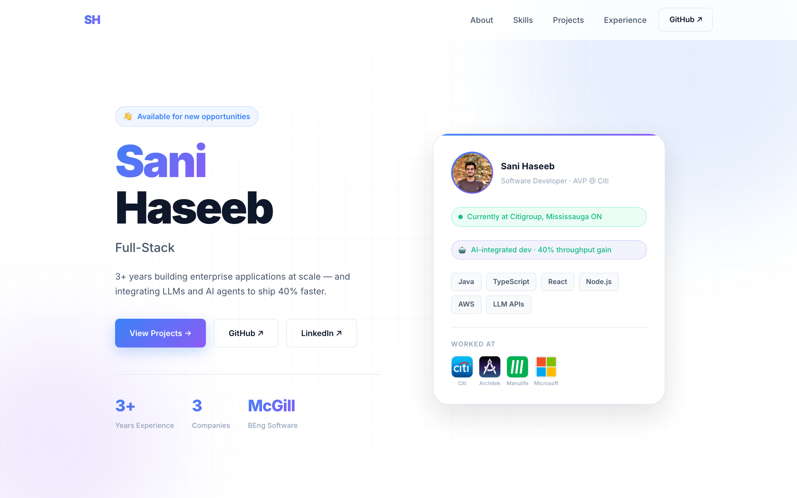
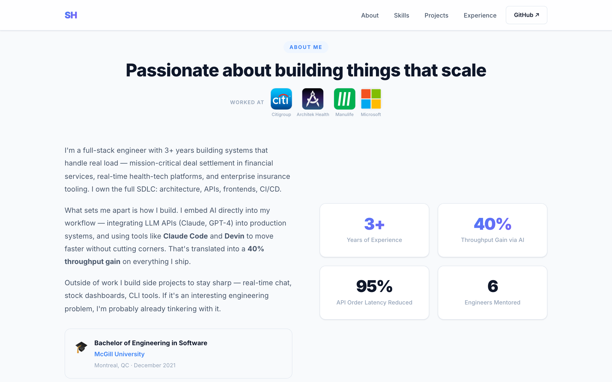
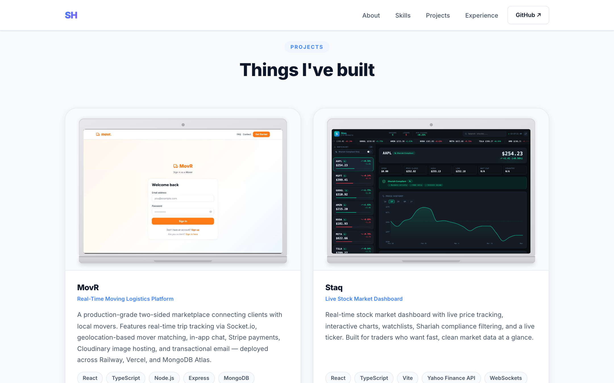
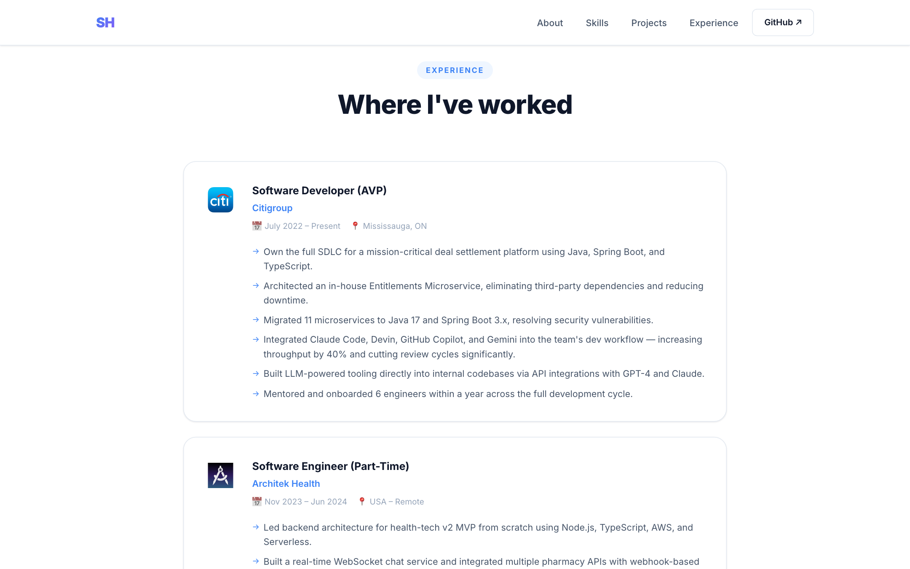
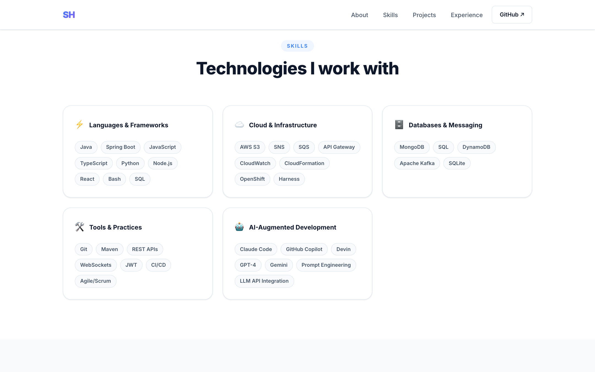

# Sani Haseeb — Portfolio

Personal portfolio site built with React, Vite, and Node.js.

---

## Hero



---

## About



---

## Projects



---

## Experience



---

## Skills



---

## Tech Stack

| Layer | Tech |
|---|---|
| Frontend | React 18, Vite, CSS |
| Data | `src/data/portfolio.js` |
| Screenshots | Puppeteer |
| Video recording | Playwright + ffmpeg |

## Running locally

```bash
cd client
npm install
npm run dev
```
